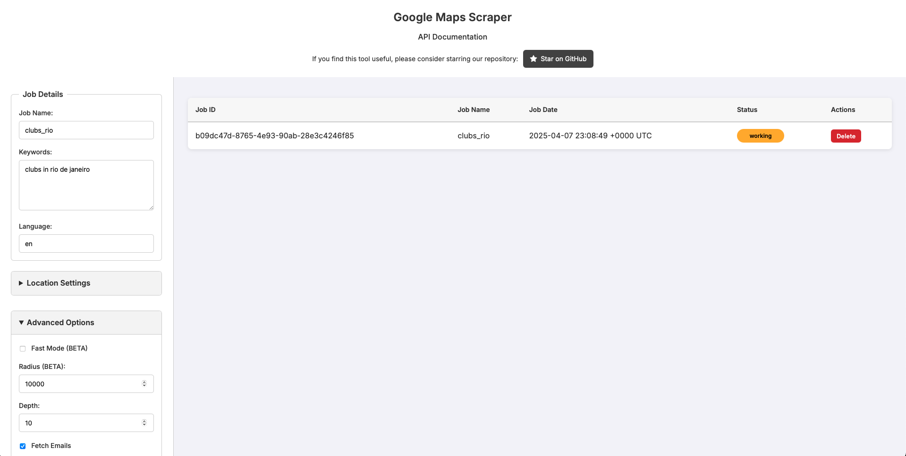

GoogleMapsScraper is a lightweight tool that lets you scrape business data directly from Google Maps — no browser automation or API key required. A free and open-source Google Maps scraper with both command line and web UI options. This tool is easy to use and allows you to extract data from Google Maps efficiently.

---

## Preview

---

## Features

- Search Google Maps and extract:
  - Business names
  - Addresses
  - Phone numbers
  - Websites
  - Ratings
  - Emails
- Local web interface at [http://localhost:8080](http://localhost:8080)
- Fast and lightweight
- No browser automation
- No API key needed

---

## Web Version

Prefer not to install? You can try the **online version** here:  
[https://google-maps-scraper-6lcb.onrender.com/](https://google-maps-scraper-6lcb.onrender.com/)

> [!NOTE]
> The web version may be slower due to server resource limits. For the best performance, use the macOS app locally.

---

## MacOS Version Notes

- Wrapped in a native `.app` bundle
- Runs a local server and opens in your default browser
- Drag and drop the app to your Applications folder
- If macOS blocks the app:
  - Go to **System Preferences > Security & Privacy**
  - Click **"Open Anyway"**

---

## Installation

### Step-by-step

1. Download the `.dmg` file from [Releases](https://github.com/melogabriel/google-maps-scraper/releases)
2. Open it and drag `GoogleMapsScraper.app` into your **Applications** folder
3. Launch the app — it will open your browser at [http://localhost:8080](http://localhost:8080)

---

> [!Warning]
> This is an **unofficial pre-release** build for macOS.  
> If you encounter any issues or bugs, please report them in the [Issues tab](https://github.com/melogabriel/google-maps-scraper/issues).

---

For Windows version check: https://github.com/gosom/google-maps-scraper/releases

## License

This project is licensed under the MIT License. See [LICENSE](LICENSE) for more information.

